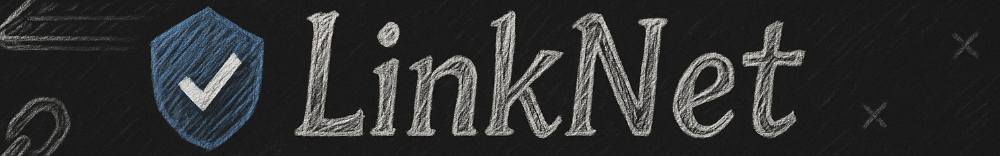

<div align="center">

  <p><strong>Next-generation P2P messaging and file transfer in C++ with military-grade encryption</strong></p>
  <p><sub>Cut the middleman. Own your data. Never compromise on security.</sub></p>

<div>
    <a href="https://isocpp.org/">
        
    </a>
    <a href="https://opensource.org/licenses/MIT">
        
    </a>
    <a href="https://cmake.org/">
        
    </a>
    <a href="https://www.boost.org/">
        
    </a>
    <a href="https://www.openssl.org/">
        
    </a>
    <br>
    <a href="https://www.docker.com/">
        
    </a>
</div>
    <a href="https://github.com/tejas242/LinkNet/actions/workflows/ci.yml">
        
    </a>
  <br>
</div>

> [!WARNING]
> NOT WORKING!!!
> Will fix the problems later, or just open a PR if you can. and also issues as you encounter.

## Overview

**LinkNet** is a high-performance C++ application that enables direct peer-to-peer communication between users for both text messaging and file sharing. Built with security in mind, all communications are end-to-end encrypted to ensure complete privacy and data integrity.

This project demonstrates advanced C++ programming concepts including:
- Network programming using Boost.Asio
- Cryptographic implementations with OpenSSL and libsodium
- Multithreaded programming for concurrent operations
- Modern C++17 features and best practices

### Features

<table>
  <tr>
    <td><strong>Peer-to-peer Architecture</strong></td>
    <td>Direct communication without centralized servers, ensuring greater privacy and eliminating single points of failure</td>
  </tr>
  <tr>
    <td><strong>Text Chat</strong></td>
    <td>Real-time messaging between peers with delivery confirmation and history tracking</td>
  </tr>
  <tr>
    <td><strong>File Sharing</strong></td>
    <td>Transfer files directly between peers with progress tracking and integrity verification</td>
  </tr>
  <tr>
    <td><strong>End-to-End Encryption</strong></td>
    <td>Secure communications using modern cryptographic algorithms (AES-256, ChaCha20-Poly1305)</td>
  </tr>
  <tr>
    <td><strong>Peer Discovery</strong></td>
    <td>Automatic discovery of peers on local networks using multicast DNS</td>
  </tr>
  <tr>
    <td><strong>NAT Traversal</strong></td>
    <td>Advanced techniques to establish connections through firewalls/NATs using UDP hole punching</td>
  </tr>
</table>

## Requirements

<details open>
<summary><strong>Dependencies</strong></summary>

| Dependency | Version | Purpose |
|------------|---------|---------|
| C++ Compiler | GCC 8+, Clang 6+, MSVC 2019+ | C++17 compatible compiler |
| [CMake](https://cmake.org/) | 3.15+ | Build system |
| [Boost](https://www.boost.org/) | 1.70+ | Networking (Asio), synchronization primitives |
| [OpenSSL](https://www.openssl.org/) | 1.1.1+ | Cryptographic operations |
| [Protocol Buffers](https://developers.google.com/protocol-buffers) | 3.0+ | Data serialization |
| [libsodium](https://libsodium.org/) | 1.0.18+ | Advanced cryptographic functions |

</details>

## Building and Running

### Native Build

```zsh
# Clone the repository
git clone https://github.com/tejas242/LinkNet.git
cd LinkNet

# Create build directory
mkdir -p build && cd build

# Configure and build
cmake ..
make -j$(nproc)  # Use multiple cores for faster build

# Run tests
ctest -V

# Run the application
./bin/linknet --port=8080
```

### Docker Build

LinkNet can be easily built and run using Docker, which eliminates the need to install dependencies locally.

```zsh
# Build the Docker images
docker compose build

# Run two LinkNet nodes in separate containers
docker compose up -d

# Connect to the containers
docker attach linknet-node1  # In terminal 1
docker attach linknet-node2  # In terminal 2

# Connect the nodes (from inside node1)
/connect 172.28.0.3:8081

# Exit containers with Ctrl+P, Ctrl+Q to detach (without stopping)
# To stop the containers when done
docker compose down
```

## Usage Guide

### Starting a LinkNet Node

```zsh
# Run with default port (8080)
./bin/linknet

# Run with a specific port
./bin/linknet --port=8081

# Disable automatic peer connection
./bin/linknet --no-auto-connect
```

### Command-line Interface

Once running, LinkNet provides an intuitive command-line interface:

| Command | Description | Example |
|---------|-------------|---------|
| `/connect <ip:port>` | Connect to a specific peer | `/connect 192.168.1.5:8081` |
| `/chat <peer_id> <message>` | Send a chat message to a specific peer | `/chat abc123 Hello there!` |
| `/send <peer_id> <file_path>` | Send a file to a peer | `/send abc123 ~/Documents/report.pdf` |
| `/peers` | List all connected peers | `/peers` |
| `/transfers` | Show ongoing file transfers | `/transfers` |
| `/help` | Display available commands | `/help` |
| `/exit` | Exit the application | `/exit` |

You can also just type a message directly and press Enter to broadcast it to all connected peers.

### Troubleshooting Common Connection Issues

- **Can't discover peers:** Make sure both instances are on the same network and multicast is supported
- **Connection refused:** Verify the target port is correct and not blocked by firewalls
- **Messages not sending:** Ensure a successful connection has been established with `/peers`
- **Peer discovery not working:** Some networks block multicast packets; use direct `/connect` instead

## Project Structure

<details open>
<summary><strong>Directory Organization</strong></summary>

```
LinkNet/
├── include/                # Public header files
│   └── linknet/
│       ├── network.h       # Network interface definitions
│       ├── message.h       # Message types and serialization
│       ├── chat_manager.h  # Chat functionality
│       ├── file_transfer.h # File transfer operations
│       ├── crypto.h        # Cryptographic operations
│       └── ...
├── src/                    # Implementation files
│   ├── network/            # Network implementations (Asio, etc.)
│   ├── chat/               # Chat system implementation
│   ├── file/               # File sharing implementation 
│   ├── crypto/             # Cryptographic implementations
│   ├── discovery/          # Peer discovery mechanisms
│   ├── common/             # Common utilities
│   └── ui/                 # User interface code
├── test/                   # Unit and integration tests
├── docs/                   # Documentation
├── examples/               # Example use cases
├── third_party/            # Third-party libraries
└── docker-compose.yml      # Docker configuration for testing
```
</details>

## Architecture

LinkNet follows a modular, layered architecture that separates concerns and promotes maintainability:

<div align="center">
  <table>
    <tr>
      <td align="center">User Interface Layer</td>
      <td>Console UI, commands processing, display formatting</td>
    </tr>
    <tr>
      <td align="center">Application Layer</td>
      <td>Chat Manager, File Transfer Manager, high-level operations</td>
    </tr>
    <tr>
      <td align="center">Security Layer</td>
      <td>Encryption, Message Authentication, Key Management</td>
    </tr>
    <tr>
      <td align="center">Session Layer</td>
      <td>Connection Management, Peer Sessions, Message Routing</td>
    </tr>
    <tr>
      <td align="center">Transport Layer</td>
      <td>TCP/IP Communication, Socket Management, Packet Handling</td>
    </tr>
    <tr>
      <td align="center">Discovery Layer</td>
      <td>Peer Discovery, Multicast Management, Network Scanning</td>
    </tr>
  </table>
</div>

### Key Components

1. **NetworkManager**: Handles all network communication, using Boost.Asio for asynchronous I/O
2. **ChatManager**: Manages messaging between peers, including history tracking
3. **FileTransferManager**: Handles chunked file transfers with progress tracking and verification
4. **PeerDiscovery**: Implements automatic peer discovery on local networks
5. **Message**: Base class for all message types with serialization/deserialization

## Implementation Details

<details>
<summary><strong>Network Communication</strong></summary>

LinkNet uses Boost.Asio for asynchronous network I/O, providing:
- Non-blocking socket operations
- Completion handlers for event-driven architecture
- Support for both IPv4 and IPv6
- Efficient thread management

Example of asynchronous accept operation:
```cpp
void StartAccept() {
  _acceptor.async_accept(
    [this](const boost::system::error_code& ec, tcp::socket socket) {
      if (!ec) {
        // Handle new connection
        auto session = std::make_shared<PeerSession>(std::move(socket), ...);
        session->Start();
      }
      // Continue accepting connections
      StartAccept();
    });
}
```
</details>

<details>
<summary><strong>Message Protocol</strong></summary>

Messages use a simple binary protocol:
1. Message Type (1 byte)
2. Sender ID (32 bytes)
3. Message ID (16 bytes)
4. Timestamp (8 bytes)
5. Payload Length (4 bytes)
6. Payload (variable length)

All multi-byte integers are transmitted in network byte order.
</details>

<details>
<summary><strong>Cryptographic Security</strong></summary>

LinkNet employs several cryptographic mechanisms:

- **AES-256-GCM** for symmetric encryption
- **X25519** for key exchange
- **Ed25519** for digital signatures
- **BLAKE2b** for hashing
- **ChaCha20-Poly1305** as an alternative cipher

Keys are rotated periodically to maintain forward secrecy.
</details>

## Testing

LinkNet includes comprehensive testing:

```zsh
# Run all tests
cd build && ctest

# Run specific test category
cd build && ctest -R crypto_tests

# Run with verbose output
cd build && ctest -V
```

## Contributing

Contributions are welcome and appreciated! Here's how you can contribute:

1. Fork the repository
2. Create your feature branch (`git checkout -b feature/amazing-feature`)
3. Commit your changes (`git commit -m 'Add some amazing feature'`)
4. Push to the branch (`git push origin feature/amazing-feature`)
5. Open a Pull Request

Please make sure your code follows the [Google C++ Style Guide](https://google.github.io/styleguide/cppguide.html).

## License

This project is licensed under the MIT License - see the [LICENSE](LICENSE) file for details.

---

<div align="center">
  <sub>Built with ⚡ by <a href="https://x.com/the_screenager" target="_blank">@screenager</a></sub>
</div>
